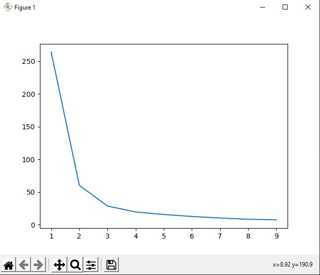

# ACM Research Coding Challenge (Fall 2020)

## Question One

 

Python Libraries Used: scikit-learn, Matplotlib, NumPy, pandas

I've taken AP statistics in high school and I've briefly worked with data science in Python, so it took me some research to come up with a working solution for the problem. After looking at potential clustering methods from scikit-learn, I decided on K-Means clustering (which partitions data-points into k-clusters depending on close they are to each cluster's mean). However, I encountered a problem: the algorithm needs a desired number of clusters as its input. To find the optimal amount of clusters, I generated K-means models for Ks 1 to 9. I generated a graph of the inertias for each model to make an 'elbow' graph, where the x-coordinate of the elbow is the optimal amount of clusters. Since the elbow will generally be the farthest point from the secant point of the graph, I created a simple loop which returns the x-coordinate (k-value) of the point farthest from the secant line.

Sources Used: https://www.dataquest.io/blog/k-means-clustering-us-senators/ for k-means idea
              https://www.youtube.com/watch?v=IEBsrUQ4eMc, https://en.wikipedia.org/wiki/Determining_the_number_of_clusters_in_a_data_set for inertia idea
